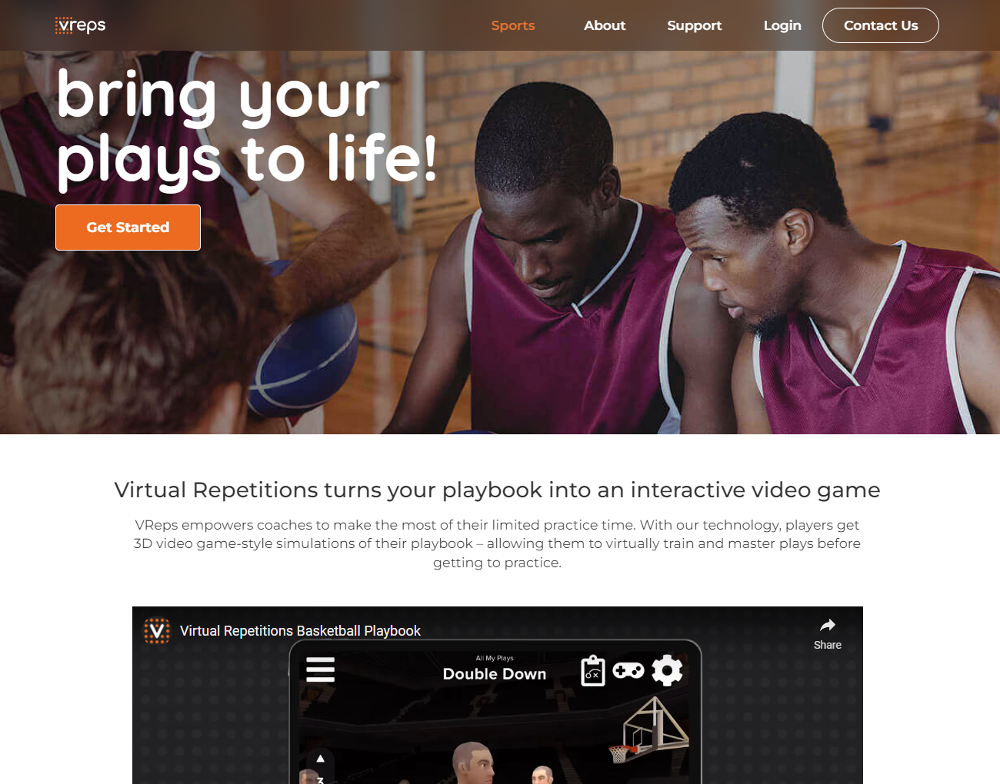
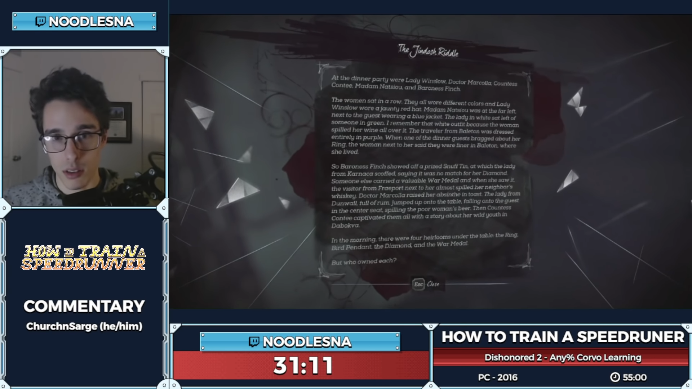
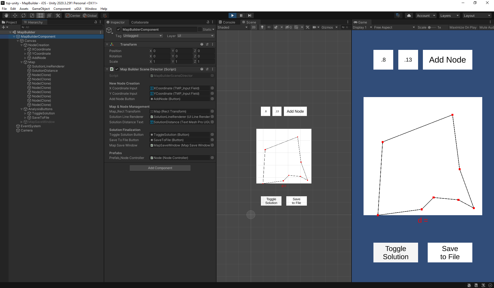

# Virtual Repetitions
[Website](https://vreps.us)
- Development in Unity 3D
- Usage of Unity Gaming Services for Analytics, Remote Settings and Cloud Builds
- Partnerships with the Cleveland Cavaliers, Columbia Lions, Fordham Rams
- Fully remote and independent work scheduling on a team of 2-4 members
## Trevor! the Traveling Salesman
- Work-in-progress iOS Unity Game
- Solve increasingly difficult TSP maps
## Twitch Broadcasting
[Website](https://twitch.tv/NoodlesNA)
- Live online entertainment for prolonged periods, with revenue collected by running advertisements or garnering paid subscriptions from viewers
- Performed a 24-hour Charity Livestream benefiting Beaumont Children's Hospital, raising $300+
- Instructed a 3,000-viewer audience on how speedrun multiple video games over 3+ hours on the official [GamesDoneQuick](https://gamesdonequick.com/) [Twitch page](https://www.twitch.tv/gamesdonequick)
### Gallery

### Contact
<a href="Resume 2022.pdf">Resume</a> | <npnapoleone@gmail.com>
